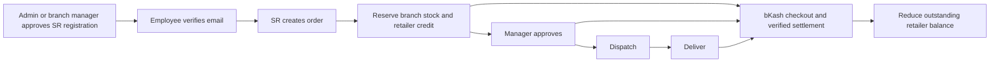

# DMS architecture and business review

Reviewed against the local `L2B7-Project-PH-Healthcare-Backend` reference and the supplied
backend assignment requirements. This is a code review plus regression testing, not a
certification of a running deployment.

## Conclusion

The idea is coherent as a distributor's B2B ordering and collection backend. Three staff
roles manage a shared product/retailer directory, branch inventory, retailer credit,
order approvals and bKash settlement. Retailers are business records, not login roles.
Credit ordering is meaningful here because final payment is verified through the gateway;
credit reservation itself is never marked as paid.

## Structure compared with Healthcare

| Concern | Healthcare reference | DMS decision |
| --- | --- | --- |
| HTTP entry | `src/app.ts`, `src/server.ts` | Same separation |
| Features | `src/app/module/<feature>` | Same modular layout |
| Request flow | route ? middleware ? controller ? service | Same pattern |
| Validation | feature `.validation.ts` files | Body and list/filter schemas now live with each feature |
| Shared helpers | middleware, utils, lib, config, templates | Same responsibilities; only generic query rules stay shared |
| Data model | `prisma/schema/*.prisma` and migrations | Same split schema approach |
| Payload types | module `.interface.ts` where needed | Existing DMS module types retained; no empty files added |
| Response/errors | `sendResponse`, `catchAsync`, `AppError` | Shared DMS helpers retained |
| Business workflows | appointment booking, slots, doctor approval | DMS uses stock/credit reservation and staff/order approval |

The reference is useful for organization but should not be copied mechanically. For example,
its appointment transaction uses outer `prisma` reads inside a `$transaction` callback, and
its `app.ts` includes a `/test` route that logs a gateway token. DMS keeps transactional
operations on `tx` and does not import that debug route. Its four-role healthcare enum also
does not match this assignment's three-role rule.

## Corrections in this review

- Staff registration now requires a super-admin or the selected branch's manager. Approval
  identity is persisted in Redis and checked again on email verification. Unknown Google
  users cannot create staff accounts or choose their own branch.
- Google identity linking requires a verified email and does not overwrite an existing,
  different Google subject.
- Logout and password reset revoke existing bearer and refresh tokens using `tokenVersion`.
  Logout intentionally signs out all devices; per-device sessions are not implemented.
- OTP check, attempt counting and consumption now execute as one Redis operation, avoiding
  double use under concurrent requests. Staged registration cannot be overwritten while pending.
- Inventory adjustment now uses atomic increments and conditional decrements, preventing lost
  updates and negative stock.
- Last-admin protection covers demotion as well as deactivation. Both serialize membership
  changes with the same database advisory lock.
- Retailer deletion locks and rechecks the balance inside the transaction, so a concurrent
  order cannot have its credit hidden by a stale deletion check.
- Order arithmetic uses Decimal values throughout. Fractional cents, duplicate product lines
  and zero/negative payable amounts are rejected; product locks use consistent ordering.
- Dashboard unpaid counts exclude cancelled orders, and low-stock counts exclude deleted
  products/branches.
- Feature-specific query validation was moved from the shared utility into module validation
  files, matching the reference's organization.

The earlier payment scoping, checkout reservation, order-row locking and idempotent settlement
fixes remain in place.

## Explicit v1 business choices

- Retailers and their credit are shared distributor-wide; there is no branch-to-retailer
  assignment model. Product catalog is shared; branch inventory is separate.
- Inventory and credit are reserved when an order is pending. These represent commitments;
  they are not a separate accounts-receivable ledger. Cancellation releases both.
- Managers can review the SR's discount and approve/reject the pending order. There is no
  configurable discount cap, margin enforcement, tax engine or promotion system.
- Quantity is an integer count of the selected selling unit. A KG product is currently sold
  in whole kilograms; carton/unit conversion and fractional quantities are not modeled.
- Payment before delivery is allowed. Refunds and returns are not implemented, so paid orders
  cannot be cancelled through the normal cancellation endpoint.
- Gateway timeouts and unidentified reservations stay pending for reconciliation. There is
  no operational reconciliation dashboard or automatic recovery worker yet.
- Pending stock reservations have no automatic expiry. Staff must approve or cancel them.
- Batch/lot/expiry tracking, stock transfers, suppliers/purchases, returns, retailer ledgers,
  and sales-representative targets are future features rather than part of the supplied
  generic assignment requirements. Avoid presenting this as a complete distribution ERP.

## Verification and rollout

`npm test` exercises HTTP/service behavior using database, Redis, email and gateway doubles.
It includes approval/role boundaries, session revocation, inventory races, admin demotion,
retailer-deletion checks, decimal totals, and earlier payment/order regression cases.
These checks do not prove behavior against a live PostgreSQL, Redis or bKash deployment.

Apply `prisma/migrations/20260907150000_user_token_version/migration.sql` using
`npx prisma migrate deploy` before running the new build. No existing user data is deleted.
Pending registrations staged before approval tracking was added must be restarted by an
admin/manager. Existing unapproved or demo accounts are not automatically deactivated.
